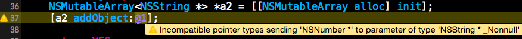

## Master en Desarrollo de Software para Dispositivos móviles

#Tecnologías para el desarrollo de aplicaciones en dispositivos móviles

##Introducción al *framework* Foundation

---

##Puntos a tratar

- Conceptos básicos de *Foundation*
- NSObject
- Colecciones
- Genéricos

---

# Conceptos básicos

---

##¿Qué es Foundation?

Conjunto de clases básicas y utilidades que no existen en el *vanilla* Objective-C

* Tipos primitivos para mejorar portabilidad
* Colecciones, cadenas, fechas, ...
* Clase raíz de la jerarquía de clases: `NSObject`

---

##Tipos primitivos de Foundation/Cocoa

- Definidos simplemente con `typedef`, su objetivo es mejorar la portabilidad
- `NSInteger` y `NSUInteger` como sustitutos de `int` y `unsigned int` 
    + Definidos como 32/64 bits según la versión de la plataforma
- `CGFloat`: sustituto para `float/double`

---

##Clases mutables e inmutables

- Ciertas clases de Foundation/Cocoa son **inmutables**, una vez instanciado un objeto no se puede modificar. Ejemplo: `NSString`. Otras son **mutables**.
- Para cada clase básica (cadena, lista, diccionario, ...) generalmente tenemos versión inmutable (NSXxx...) y mutable (NSMutableXxx)

```objectivec
//Este tipo es inmutable
NSString *mensaje = @"Hola";
//Este no
NSMutableString *mensaje2 = [[NSMutableString alloc] initWithString:@"hola"];
[mensaje2 appendString:@" mundo"];
```

---

# NSObject: la raíz de la jerarquía de objetos

---

##`NSObject`

- Es la raíz de la jerarquía de clases
- Todas las clases deben heredar de ella

```
@interface MiClase : NSObject

@end
```

- Incluye métodos de utilidad

---

##`NSObject`: métodos para copia de objetos

```
// La cadena original es inmutable
NSString *cadena = @"Mi cadena";
NSString *copiaInmutable = [cadena copy]; 
NSMutableString *copiaMutable = [cadena mutableCopy]; 
```
- Podemos hacer que `copy` funcione con nuestras clases implementando [algunos métodos](http://www.techotopia.com/index.php/Copying_Objects_in_Objective-C)

---

##`NSObject`: información sobre una instancia

- **Sobreescribiremos** estos métodos en nuestras clases. Las clases de Foundation/Cocoa ya lo hacen.
- `isEqual`: comprobar igualdad entre clases. Como el `equals` de Java

        //Esto no va a ser cierto, '==' comprueba igualdad de referencias
        if (@"hola"==@"hola")
           NSLog(@"Mal");
        //Esto sí es correcto
        if ([@"hola" isEqual:@"hola"])
           NSLog(@"OK");

---

##`NSObject`: info. sobre una instancia (2)

- `description`: debe devolver un `NSString*` con una descripción legible. Idem al `toString` de Java.

```
NSDate *fecha = [[NSDate alloc] init];
NSLog(@"%@", [fecha description]); //2014-10-11 13:52:44 +0000

```

- `hash`: dos objetos iguales deberían tener el mismo valor (un `NSUInteger`)

---

# Colecciones


---

##Colecciones

- Todas las colecciones de Foundation vienen en una versión "inmutable" y otra "mutable". 
- Cuando se añade un objeto a una colección mutable lo que se está añadiendo es una referencia, no una copia

---

##*Wrappers* de tipos primitivos

- Las colecciones son conjuntos de **objetos**, por lo que directamente no pueden almacenar valores **primitivos** (`int`, `float`,...) . Tenemos que "empaquetarlos" en objetos usando *wrappers*.
- `NSNumber` es un *wrapper* para datos numéricos

```
//definimos un NSNumber precediendo un literal de '@' (similar a cadenas)
NSNumber *num = @7.25;
float flo = 3.5;
//Si es una expresión necesitamos paréntesis
NSNumber *otro_num = @(flo);
```

---

##Listas

- Versión inmutable: `NSArray` , la mutable es su subclase `NSMutableArray`
- Un `NSArray` puede contener objetos de distintas clases. Además, los `NSMutableArray` pueden cambiar no solo de **contenido** sino también de **tamaño**.

---

##Inicialización de listas

- Lo más sencillo es con literales para las inmutables. Para las mutables necesitamos métodos

```
//Obsérvese que contiene distintas clases
NSArray *a = @[@1, @"hola"];
NSMutableArray *mut = [NSMutableArray arrayWithObjects:
                               @1, @"Hola", nil]; 
```

---

##Listas: algunos métodos útiles

<pre><code class="objectivec">
NSMutableArray *mut = [NSMutableArray arrayWithObjects:
                               @"Alo", @"Hola", nil]; 
//Insertar en una posición. Los existentes se "desplazan" a la derecha       
[mut insertObject:@"Hello" atIndex:0];
//cuántos elementos tiene
[mut count] 
//Eliminar todas las apariciones de un objeto
[mut removeObjectIdenticalTo:@"Hola"];
//Se puede usar notación "clásica" de array
NSLog(@"%@", mut[0]);
//los predicados nos permiten expresar condiciones para filtrar datos
NSPredicate *comienza_por_h = [NSPredicate predicateWithFormat:@"SELF beginswith[c] 'h'"];
//ahora contendrá solo @"Hello"
[mut filterUsingPredicate:comienza_por_h]; 
</code></pre>


---

##Diccionarios

- Conjunto de pares `(clave, valor)`. Las claves suelen ser `NSString`, pero se puede usar cualquier clase copiable (conforme a `NSCopying`) e implemente `isEqual` y `hash`.
- `NSDictionary` es la versión inmutable y `NSMutableDictionary` la mutable.

---

##Diccionarios: algunos métodos útiles

<pre><code class="objectivec">
//Inicializar inmutables con literales
NSDictionary meses = @{
   @"Enero" : @31,
   @"Febrero" : @28,
   @"Marzo" : @30
}
//Inializar mutables con método factory
//Varias posibilidades, por ejemplo a partir de arrays con valores y claves
NSArray *nombres = @[@"Enero", @"Febrero", @"Marzo"];
NSArray *dias = @[@31, @28, @30];    
NSMutableDictionary *meses = [NSMutableDictionary dictionaryWithObjects:dias 
                                                  forKeys:nombres];
//Para añadir podemos usar notación de "array" con la clave...
meses[@"Septiembre" ] = @30;
//... y también usar métodos
[meses setObject:@31 forKey:@"Diciembre"];
</code></pre>

---

##Recorrer colecciones

- *Fast enumeration*: es un `for-in` al estilo Java.

```
//Como no sabemos qué clases puede haber, usamos el tipo genérico: id
for(id obj in coleccion) {
    NSLog(@"Obtenido el objeto %@", obj);
}
//Si conocemos el tipo podemos especificarlo
for(NSString *cad in coleccion_palabras) {
    NSLog(@"Obtenida la cadena %@", cad);
}
//Aplicado a un diccionario, itera por las claves
for (id clave in diccionario) {
    NSLog(@"(%@, %@)", clave, [diccionario objectForKey: clave])             
}
```

- *Enumerators*: siguen el patrón "Iterator". Código menos legible.


---

# Genéricos

---

## ¿Por qué genéricos?

Como hemos visto, una colección puede contener distintos tipos de datos. El compilador no puede detectar si estamos introduciendo un determinado tipo por error o es el comportamiento deseado.

---

## Uso de genéricos

Al estilo Java

```objectivec
NSMutableArray<NSString *> *a2 = [[NSMutableArray alloc] init];
[a2 addObject:@"hola"];
```

Si intentamos añadir un tipo no compatible, el compilador nos avisa



---

# ¿...alguna pregunta?
