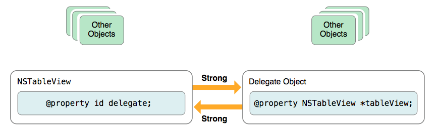

#Tecnologías para el desarrollo de aplicaciones en dispositivos móviles
##Más sobre Objective-C

---

##Puntos a tratar

- Gestión de la memoria dinámica
- Bloques
- *Key-Value-Coding*
- Extender clases sin herencia
- Gestión de errores

---

# Gestión de la memoria dinámica

---

##Cómo liberar memoria

- Hemos visto cómo reservar memoria con `alloc` pero no cómo liberarla. **La liberación de memoria es automática**.

- En la mayoría de lenguajes de este tipo se usa *Recolección de basura* (Java, Python,...). Se decide cómo actuar en **tiempo de ejecución**

- En iOS *el compilador inserta automáticamente las instrucciones que liberan la memoria en el punto adecuado*. El momento en que se libera la memoria se determina en **tiempo de compilación**. 


---

##Cuenta de Referencias Automática (ARC)

- Para cada objeto se mantiene una **cuenta de referencias**

- Cuando se reserva con `alloc` la cuenta se pone a 1

```objectivec
NSMutableString *mensaje;  //cuenta=0;
mensaje = [[NSMutableString alloc] initWithString:@"Hola"]; //cuenta=1
```

---

Algunas operaciones incrementan la cuenta en 1

  * Asignar el objeto a otra variable
  * Recibir el objeto como argumento de un método

```objectivec
NSMutableString *mensaje;  //cuenta=0;
mensaje = [[NSMutableString alloc] initWithString:@"Hola"]; //cuenta=1
mensaje2 = mensaje; //cuenta=2
```

---

El compilador se asegura de que por cada vez que ha incrementado la cuenta se decrementa (hay un *balanceo*)

```objectivec
- (void) hacerUnaCosita {
  NSMutableString *mensaje;  //cuenta=0;
  mensaje = [[NSMutableString alloc] initWithString:@"Hola"]; //cuenta=1
  mensaje2 = mensaje; //cuenta=2
}
```
Al salir del método, ambas variables se pierden ya que eran locales. El compilador decrementa 1 por cada variable

---

Finalmente, **cuando la cuenta llega a 0 se libera la memoria**

---

##Gestión de memoria manual

- Antes de ARC, el programador era el responsable de incrementar/decrementar la cuenta *manualmente*, con los métodos `retain` y `release`

<pre><code class="objectivec">
- (void) miMetodo:(MiClase *)objeto {
    //Incrementa la cuenta en 1. 
    //Vamos a operar con él y no queremos que se libere la memoria
    [retain objeto];
    [objeto operacion1];  
    ...
    //Ya no lo necesitamos, lo "dejamos libre" 
    [release objeto];
}
</code></pre>

<!--.element class="fragment"--> Con ARC **es el compilador el que introduce automáticamente los `retain/release`**


---

##El problema de los ciclos

- Podemos tener un ciclo de objetos referenciándose unos a otros. La cuenta de referencias de todos es **>0** aunque no haya referencias externas y por tanto sean **inaccesibles**.



---

##Solución a los ciclos: referencias débiles

- referencia **weak**: si un objeto solo tiene referencias débiles apuntando a él se considera elegible para liberar su memoria
```
//Con propiedades
@property(weak) NSString *referencia_debil;
//Si trabajamos directamente con variables de instancia
NSString * __weak referencia_debil;
```
- Regla práctica: usar las referencias normales (**strong**) solo cuando queramos reflejar propiedad o responsabilidad de un objeto sobre otro

---

# Bloques


---

##Bloques

Permiten **tratar un fragmento de código como un objeto**, pudiéndolo asignar a una variable, pasarlo como parámetro de un método, etc.

<pre><code class="objectivec">
[UIView animateWithDuration:5.0
        animations:^{
            self.myLabel.center = CGPointMake(100, 100);
        }
        completion:^(BOOL finished){
            NSLog(@"Fin!");
        }
];
</code></pre>

---

##Definir bloques

<pre><code class="objectivec" data-trim>
//Bloque sencillo, sin parámetros
^{
   NSLog(@"Soy un bloque");
 } 

//Bloque con parámetros
^(int n1, int n2) {
   NSLog(@"Suma: %d", n1+n2);
}

//Bloque con parámetros y valor de retorno
//El tipo de retorno se puede omitir: valdría ^(int n1, int n2)
^ int (int n1, int n2) {
   return n1+n2;
}
</code></pre>

*Estos ejemplos, escritos tal cual en código darán *warnings* ya que estamos definiendo bloques pero no usándolos*

---

##Uso típico de bloques

muchos métodos de Cocoa usan bloques como parámetros

<pre><code class="objectivec">
[NSURLConnection asyncRequest:request  
      success:^(NSData *data, NSURLResponse *response) {  
          NSLog(@"Success!");  
      }  
      failure:^(NSData *data, NSError *error) {  
              NSLog(@"Error! %@",[error localizedDescription]);  
      }
];      
</code></pre>

---

##Clausuras

Los bloques  **capturan el valor de las variables referenciadas**. Pueden usarlo *aunque estas variables hayan desaparecido del ámbito* antes de que se ejecute el bloque

<pre><code class="objectivec" data-trim>
//Si esto es un view controller, la propiedad "view" referencia a la vista
// y el método "center" nos devuelve las coordenadas de su centro
//Lo siguiente es una variable local
CGPoint centro = [self.view center];
//Nótese que la animación se ejecuta con un retardo de 10 segundos
//Mucho antes la variable "centro" se debería haber salido del ámbito
[UIView animateWithDuration:2.0 delay:10
        options:UIViewAnimationOptionAutoreverse|UIViewAnimationOptionRepeat
        animations:^{
            self.myLabel.center = centro;
        }
completion:nil];
</code></pre>

---

##Bloques y concurrencia

Los bloques nos dan la posibilidad de usar una **sintaxis concisa y relativamente “limpia”** para especificar código que se debe ejecutar de manera concurrente.

---

##Colas de operaciones

Abstracción que permite *multithreading* sin tener que asignar explícitamente los *threads*

<pre><code class="objectivec">
NSOperationQueue *queue = [[NSOperationQueue alloc] init];
[queue addOperationWithBlock:^{
       NSLog(@"Yo soy una operación concurrente");
}];
[queue addOperationWithBlock:^{
       NSLog(@"Yo también soy concurrente");
}];
</code></pre>

---


- El **código que actualiza el UI** debería ejecutarse en el *thread* principal, ya que es donde se procesan los eventos y donde trabajan los *frameworks* UI del sistema
- La cola de operaciones "principal" (`[NSOperationQueue mainQueue]`) siempre se ejecuta en el *thread* principal

<pre><code class="objectivec" data-trim>
NSOperationQueue *queue = [[NSOperationQueue alloc] init];
//Tenemos un trabajo que queremos hacer concurrente, dado su coste
[queue addOperationWithBlock:^{
      datos = procesar_datos();
      //Pero la  actualización del UI la hacemos en el hilo principal
      [[NSOperationQueue mainQueue] addOperationWithBlock: ^{
           dibujar_datos(datos);
       }];
 }];
</code></pre>

---

# *Key-Value-Coding*

---

##Key-Value Coding

Nos permite especificar el nombre de la propiedad a obtener/fijar como un `NSString`. Por tanto podemos **seleccionar la propiedad dinámicamente **, en tiempo de ejecución.


<pre><code class="objectivec" data-trim>
NSString *nomPropiedad;
...
//Le damos el valor que sea a "nomPropiedad"
...
//Accedemos al valor de la propiedad con nombre "nomPropiedad"
id valor = [unObjeto valueForKey:nomPropiedad];
//La cambiamos
[unObjeto setValue:nuevoValor forKey:nomPropiedad] 
</code></pre>

---

## Más sobre KVC

- Para que una clase sea “KVC-compliant” debe seguir las convenciones de nombre que ya hemos visto para el *getter* y el *setter*.
- Si aplicamos KVC sobre una colección es como si estuviéramos aplicándolo secuencialmente sobre cada uno de los elementos. 

<pre><code class="objectivec" data-trim>
//obtener un array con todos los valores de determinada propiedad    
NSArray *nombres = [lista valueForKey:@"nombres"];`  
//cambiar determinada propiedad para todos los componentes de una colección
[lista setValue:@"100" forKey:@"credito"]
</code></pre>

---

# Modificar una clase sin usar herencia

---

##Categorías y extensiones

Para *personalizar* una clase ampliando su comportamiento habitualmente se usa la herencia, pero no siempre es adecuada.

- **Categorías**: añadir comportamiento a una clase existente sin modificar directamente su código ni usar herencia. *(monkey patching)* 
- **Extensiones**: ampliar o modificar el API interno de una clase. Se pueden añadir métodos, propiedades y variables de instancia *que desde fuera no van a ser visibles*∫. 

---

# Gestión de errores


---

##Gestión de errores


- Hay dos mecanismos estándar para la gestión de errores: 
    - Excepciones
    - Manejo “estilo C” con `NSError`.
- En Obj-C **las excepciones no deben usarse para errores “previsibles”**, (*ej: fallo de la red*), sino para errores de programación, (*ej: salirse de un array*). Para los primeros se debería usar `NSError`

---

##Excepciones

<pre><code class="objectivec" data-trim>
@try {
  // do something that might throw an exception
}
@catch (NSException *exception) {
  // deal with the exception
}
@finally {
  // optional block of clean-up code
  // executed whether or not an exception occurred
}
</code></pre>
 


---

##Lanzar una excepción

<pre><code class="objectivec" data-trim>
//A diferencia de Java/C++ se puede lanzar cualquier objeto, herede de quien herede
@throw @"Han pasado cosas muy malas"
</code></pre>

---

##Gestión de errores con `NSError`

"Al estilo C", donde el programador debe comprobar si ha habido o no un error tras ejecutar una sentencia y seguir el curso de acción adecuado en cada caso.

<pre><code class="objectivec" data-trim>
NSError *miError;
BOOL ok = [receivedData writeToURL:someLocalFileURL
  options:0
  error:&amp;miError];
if (miError) {
  NSLog(@"Se ha producido un error: %@", miError);
}
</code></pre>


