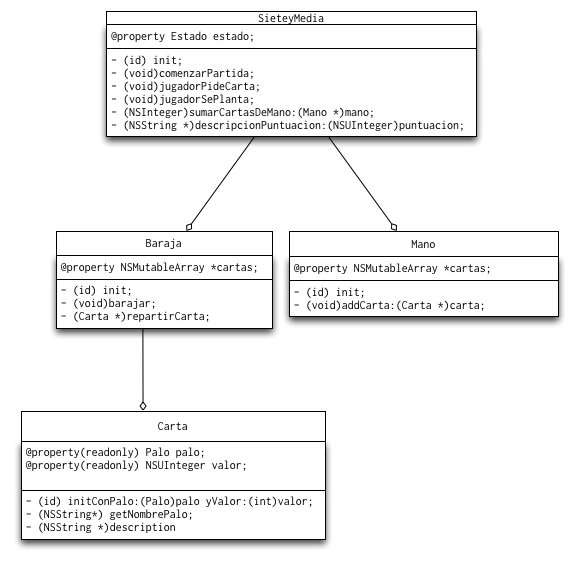

# MiniProyecto de iOS de Tecnologías de Desarrollo: Juego de las siete y media

Se propone implementar el conocido juego de cartas de "las 7 y media". Podéis implementar la versión completa en la que el usuario juega contra la máquina o bien una versión simplificada en la que el usuario intenta superar una puntuación calculada al azar y pierde si no llega o si se pasa de 7 y media


#El modelo 

##Estructura de clases (1.5 puntos)

Primero se deben crear las clases que componen el modelo, que se muestran en el siguiente diagrama UML:



Aclaraciones:

- Clase `Carta`,  
    -  `Palo` es un tipo enumerado, que podéis definir dentro de `Carta.h` (al principio, fuera de la sección `@interface`) como:

        ```objc
        typedef enum {
            Bastos, Copas, Espadas, Oros
        }  Palo;
        ```
    - `nombrePalo` debe devolver el nombre del palo como un `NSString *` (`Bastos, `Copas`,...). Luego veremos que sirve para referenciar las imágenes de las cartas.

- Clase `Juego`:
    +  `Estado` es un tipo enumerado que representa el estado del juego: por ejemplo que es el turno del jugador, que es el turno de la máquina, que el jugador se ha pasado,... podéis elegir los estados que consideréis necesarios.
    +  Se recomienda calcular internamente la puntuación multiplicada por 10 para poder usar enteros sin decimales. Es decir, usar 15 en lugar de 1.5 para evitar posibles errores de redondeo. Eso sí, el usuario no debería ser consciente de esto, solo es algo interno.
    +  El método `descripcionPuntuacion` debería devolver la puntuación en un `NSString *` con formato "amigable": "5", "6 y medio", ...

- Clase `Baraja`:
    + `init` debe crear la baraja con todas las cartas ordenadas
    + Aquí tenéis una [sugerencia](http://eureka.ykyuen.info/2010/06/19/objective-c-how-to-shuffle-a-nsmutablearray/) para implementar de manera sencilla el método `barajar`.

- Clase `Mano`:
    + `init` debe crear la mano vacía, sin cartas (el `NSMutableArray *cartas` debe inicializarse pero estará vacío).

##Pruebas unitarias (0,5 puntos)

Debéis implementar al menos las siguientes pruebas unitarias:

- Que al inicializar una `Carta` con `initConPalo:yValor` tanto el palo como el valor se han guardado correctamente (por ejemplo que al inicializar una carta como el 3 de copas si después obtenemos la propiedad `valor` nos da 3 y la propiedad `palo` nos da `Copas`).
- Que cuando se reparte una carta de la `Baraja` se ha eliminado de ella y el número de cartas ha disminuido en 1.
    > **Pista:** podemos comprobar fácilmente que un objeto no está en un `NSArray` (o en la versión mutable) si [el método `containsObject:`](https://developer.apple.com/library/ios/documentation/Cocoa/Reference/Foundation/Classes/NSArray_Class/index.html#//apple_ref/occ/instm/NSArray/containsObject:) pasándole el objeto buscado devuelve `NO`. Pero para eso tenéis que [sobreescribir primero el `isEqual`](https://developer.apple.com/library/ios/documentation/Cocoa/Reference/Foundation/Protocols/NSObject_Protocol/index.html#//apple_ref/occ/intfm/NSObject/isEqual:) en la clase `Carta`.

##Interfaz gráfico simplificado (1 punto)

> **El *controller* puede observar (por ejemplo con KVO) los cambios en la propiedad `estado`** para saber qué hacer con el interfaz gráfico (por ejemplo si el juego ha acabado hay que deshabilitar los botones de "pedir carta" y "plantarse"). 

En esta versión muy simplificada de la interfaz solo aparecen en pantalla tres botones: "pedir carta", "plantarse" y "nueva partida", pero no se ven las cartas gráficamente. Eso sí, el juego debería funcionar correctamente, imprimiendo los mensajes con `NSLog`.

> En esta versión simplificada no es necesario habilitar/deshabilitar los botones según la situación del juego (por ejemplo no hace falta deshabilitar "pedir carta" cuando la partida se ha terminado)

Además, para simplificar la mecánica del juego no es necesario que la máquina "saque cartas de verdad". Basta con generar una puntuación al azar e informar al usuario de la puntuación que ha sacado. Para que el juego tenga sentido primero debería jugar el jugador humano y luego la máquina.

> **La versión anterior es solo una idea, podéis implementar cualquier variante que queráis**, o cualquier mejora, incluyendo que la máquina saque cartas una por una, apostar una cantidad,...


##Completar la interfaz (1 punto)

En la interfaz completada deberían aparecer las cartas en pantalla conforme se van repartiendo. Además los botones se deberían habilitar/deshabilitar adecuadamente (por ejemplo si la partida se ha terminado no se puede pedir carta).

###Cómo dibujar las cartas

- Lo primero es copiar las imágenes de las cartas, que están en el directorio `miniproyecto/recursos/baraja` de las plantillas al `Images.xcassets`
- Como se ve, cada imagen tiene un nombre al estilo `1bastos`, `12copas`,... podéis cargar la imagen con un código similar al siguiente:

```objectivec
NSString *nombreImagen = [NSString stringWithFormat:@"%d%@", carta.valor, carta.nombrePalo];
UIImage *imagenCarta = [UIImage imageNamed:nombreImagen];
```
- Para mostrar la imagen de una carta en pantalla tenemos que crear una `UIImageView` , fijar sus coordenadas y añadirla como subvista de la vista actual

```objc
UIImageView *cartaView = [[UIImageView alloc] initWithImage:imagenCarta];
//El frame es el rectángulo que contiene a la vista
//Esto haría que la carta se colocara en la esquina sup. izq. de la pantalla
//(origen en la esquina sup.izq., x va hacia la derecha, y hacia abajo)
//con 70 puntos de ancho por 105 de alto (La pantalla tiene 320x480 puntos)   
cartaView.frame = CGRectMake(0, 0, 70, 105);
//En un controller, la propiedad "view" es la vista
[self.view addSubview:cartaView];
```

- Es conveniente llevar "un registro" de qué vistas se han añadido a la vista principal para poder borrarlas cuando sea necesario

```objc
//En la interfaz privada del controller
//Un array con las UIView de las cartas, para poder borrarlas luego
@property NSMutableArray *vistasCartas;
...
//En el viewDidLoad
self.vistasCartas = [[NSMutableArray alloc] init];
...
//Al comenzar otra partida
for (UIImageView *vistaCarta in self.vistasCartas) {
    //quito las vistas de la pantalla
    [vistaCarta removeFromSuperview];
}
//vacío el array
[self.vistasCartas removeAllObjects];
```

###Cómo hacer el efecto de "repartir" una carta

En lugar de dibujarlas directamente en su posición, podemos hacerlo fuera de la pantalla (por ejemplo con el origen del *frame* en coordenadas negativas) y luego hacer una animación hasta su posición definitiva. Algo como

```objc

// la ponemos fuera de la pantalla y más grande para que parezca más cerca
cartaView.frame = CGRectMake(-200.0f, -200.0f, 200, 300);
// y rotada, así al animarse también rotará si fijamos 0 como ángulo objetivo
cartaView.transform = CGAffineTransformMakeRotation(M_PI);
[UIView animateWithDuration:0.5f
    delay:0.1
    options:UIViewAnimationOptionCurveEaseOut
    animations:^{
     //"pos" debería valer 1 si es la 1ª carta de la mano, 2 si es la 2ª, etc.
     //además la dibujamos más pequeña para que parezca algo más lejos
     cartaView.frame = CGRectMake(50+70*(pos-1), 100, 70, 100);
     cartaView.transform = CGAffineTransformMakeRotation(0);
    }
    completion:^(BOOL finished){
         //aquí podemos por ejemplo habilitar el botón de pedir carta
         //ya que ya está repartida (ha acabado la animación)
     }
];
```

###Cómo manipular los botones

- Podéis habilitar/deshabilitar los botones poniendo su propiedad `enabled` a `YES` o `NO` respectivamente.
- Para que se vea gráficamente que un botón está deshabilitado podéis ponerle un color distinto según el estado. Teniendo seleccionado el botón, en el `Attributes inspector` de la parte derecha de la pantalla, seleccionar el estado que nos interese en el desplegable, al elegir colores (*text*, *shadow*, ...) serán los fijados para ese estado.


### Cómo mostrar mensajes al usuario

Podéis mostrar el resultado del juego ("has ganado", "te has pasado",...) con un `UIAlertController`, que hará aparecer el típico cuadro de diálogo modal. El siguiente código muestra un cuadro que pone "¡¡Has perdido!!", con el título "Fin del juego", y con un único botón de "OK" que no hace nada (el `handler` está vacío) 

```objectivec
UIAlertController* alert = [UIAlertController
                    alertControllerWithTitle:@"Fin del juego"
                    message:@"¡¡Has perdido!!"
                    preferredStyle:UIAlertControllerStyleAlert];
UIAlertAction* defaultAction = [UIAlertAction
                    actionWithTitle:@"OK"
                    style:UIAlertActionStyleDefault
                    handler:^(UIAlertAction * action) {}];
[alert addAction:defaultAction];
[self presentViewController:alert animated:YES completion:nil];
```


##Posibles mejoras (1 punto)

El proyecto está abierto a cualquier posible mejora o modificación que queráis hacer, por ejemplo:

- Contabilizar las partidas ganadas/perdidas
- Que se pueda apostar una cantidad y vaya contabilizando la cantidad  hasta el momento
- Que se pueda jugar contra la máquina
- Variantes del juego o implementación de otros juegos sencillos
- ...
