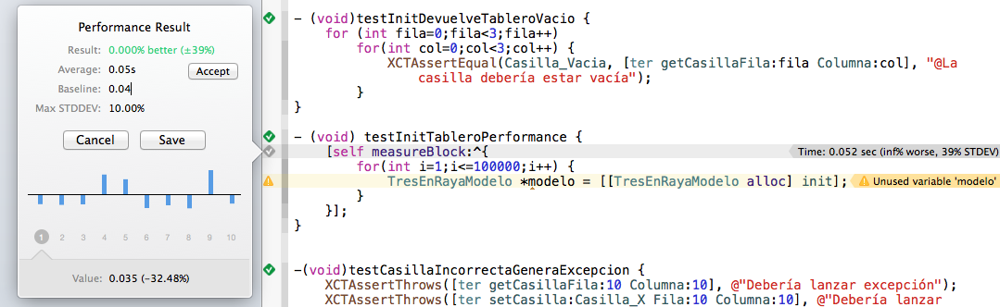

#Tecnologías para el desarrollo de aplicaciones en dispositivos móviles
##Sesión 6: *Testing* en Xcode

---

##*Testing* en Xcode

- Desde la versión 5 Xcode tiene un *framework* de *testing* llamado `XCTest`,  muy similar a `JUnit` y otros
- Cuando creamos un proyecto automáticamente se crea un conjunto de pruebas unitarias vacío (mismo nombre del proyecto, acabado en `Tests`)

---

##Tipos de pruebas

- Pruebas unitarias
- Pruebas unitarias en modo asíncrono
- Pruebas de tiempo de respuesta 
- Pruebas de interfaz de usuario

---

##El navegador de tests

Para poder ejecutar la *suite* completa o *tests* individuales


---

##Estructura de la *suite* de pruebas

- Por defecto Xcode pone  `@interface` e `@implementation` de la *suite* en el mismo archivo `.m`
- Igual que en `JUnit` los métodos `setup` y `teardown` se ejecutan al inicio y al final de cada *test*, respectivamente.
- Cada *test* se implementa en un método que debe devolver `void` y cuyo nombre debe comenzar por `test`.
Comprobamos el correcto funcionamiento de la lógica con los métodos `XCTAssert`

---

##Ejemplo

```objectivec
typedef enum {
  Casilla_Vacia,Casilla_X,Casilla_O
} Casilla;

@interface TresEnRayaModelo : NSObject
//inicializa el tablero a Casilla_Vacia
- (id) init;
- (Casilla) getCasillaFila:(int)fila Columna:(int)columna;
- (void) setCasilla:(Casilla)valor Fila:(int)fila Columna:(int)columna;
@end
```

---

##Setup y teardown

```objectivec
@implementation TresEnRayaTests {
    TresEnRayaModelo *ter;
}
...

- (void)setUp {
    [super setUp];
    ter = [[TresEnRayaModelo alloc] init];
}

- (void)tearDown {
    [super tearDown];
}

+ (void)setUp {
    NSLog(@"Yo debería salir solo una vez antes de la suite");
}
```

---

##Pruebas unitarias


Métodos cuyo nombre comienza por `test` y devuelven `void`

```objectivec
- (void)testInitDevuelveTableroVacio {
    for (int fila=0;fila<3;fila++)
        for(int col=0;col<3;col++) {
            XCTAssertEqual(Casilla_Vacia, [ter getCasillaFila:fila Columna:col]);
        }
}
```

---

##Aserciones

- `XCTAssertTrue`  y `XCTAssertFalse`  comprueban que algo es cierto o falso, respectivamente
- `XCTAssertEqual`  comprueba igualdad de valores escalares. Tenemos también el contrario, `XCTAssertNotEqual`
- `XCTAssertEqualObjects`  comprobar igualdad entre objetos. Internamente llama a `isEqual`.
- `XCTAssertThrows` comprueba que una llamada genera una excepción.

---

##Pruebas de rendimiento

Muestra estadísticas sobre el tiempo que tarda en ejecutarse un bloque de código

```objectivec
- (void) testInitTableroPerformance {
    [self measureBlock:^{
        for(int i=1;i<=100000;i++) {
            TresEnRayaModelo *modelo = [[TresEnRayaModelo alloc] init];
        }
    }];
}
```

---

##Estadísticas de rendimiento

